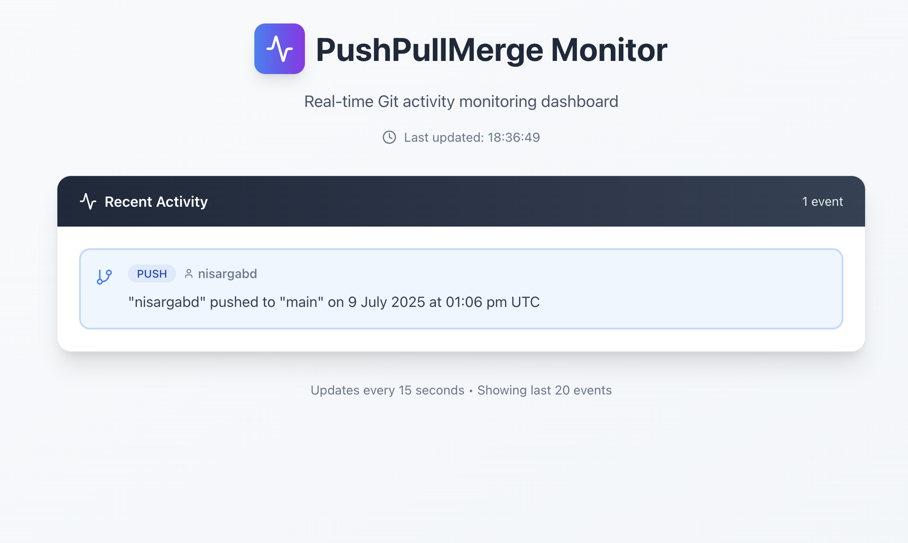

# PushPullMerge Monitor



## Overview
PushPullMerge Monitor is a full-stack application that tracks GitHub repository events (Push, Pull Request, Merge) in real time. It consists of:
- **Flask Backend**: Receives GitHub webhooks, stores events in MongoDB, and provides a REST API.
- **React Frontend**: Polls the backend every 15 seconds and displays the latest repository events in a clean, minimal UI.

---

## Features
- Real-time monitoring of GitHub Push, Pull Request, and Merge events
- Minimal, responsive UI with clear event formatting
- MongoDB Atlas or local MongoDB support
- Easy local development with tunneling (e.g., LocalTunnel, ngrok)

---

## Getting Started

### Prerequisites
- Python 3.8+
- Node.js 16+
- npm 8+
- MongoDB Atlas account (or local MongoDB)

---

## Setup Instructions

### 1. Backend (Flask)
1. Clone this repository and navigate to the backend directory:
   ```bash
   git clone <your-webhook-repo-url>
   cd webhook-repo
   ```
2. Create and activate a Python virtual environment:
   ```bash
   python3 -m venv venv
   source venv/bin/activate
   ```
3. Install dependencies:
   ```bash
   pip install -r requirements.txt
   ```
4. Set your MongoDB URI (Atlas or local):
   ```bash
   export MONGO_URI="your_mongodb_uri"
   ```
5. Run the Flask server:
   ```bash
   python main.py
   ```
   The backend will run on `http://localhost:5000` (or your chosen port).

### 2. Frontend (React + Vite)
1. Navigate to the frontend directory:
   ```bash
   cd client
   ```
2. Install dependencies:
   ```bash
   npm install
   ```
3. Start the React development server:
   ```bash
   npm run dev
   ```
   The frontend will run on `http://localhost:5173` (or your chosen port).

---

## Manual Steps Required

1. **Create two GitHub repositories:**
   - `action-repo` (dummy repo for GitHub actions)
   - `webhook-repo` (this codebase)
2. **Deploy the Flask backend** (locally or on a public server).
3. **Expose your local backend to the internet** (for GitHub webhooks) using [LocalTunnel](https://github.com/localtunnel/localtunnel), [ngrok](https://ngrok.com/), or similar:
   ```bash
   npx localtunnel --port 5000
   # or
   ngrok http 5000
   ```
4. **Configure the webhook in `action-repo`:**
   - Go to `Settings > Webhooks > Add webhook`.
   - Set the Payload URL to your Flask endpoint (e.g., `https://your-tunnel-url/webhook`).
   - Content type: `application/json`.
   - Select events: Push, Pull Request, (optionally) Merge.
5. **Test by making pushes, PRs, and merges in `action-repo`.**
6. **Open the React UI** (from `webhook-repo/client`) and verify that events appear as specified.

---

## Notes
- The backend only stores and returns the minimal required data for the UI.
- The UI polls the backend every 15 seconds and only displays new events.
- Dates are shown in UTC and formatted as required.
- For production, update CORS and API URLs as needed.

---

## Screenshots

> _Add a screenshot of your UI here (replace the placeholder above)_

---

## License

This project is for assessment and educational purposes. 